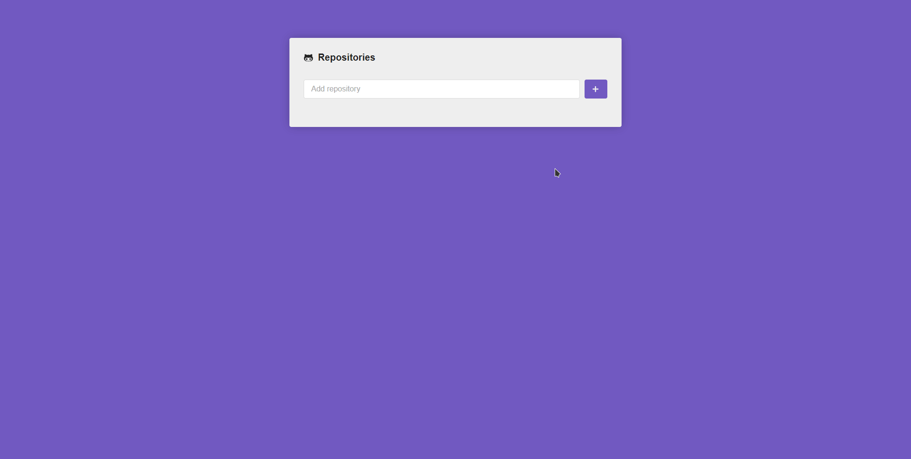

# react-github-api

📚 Small React app to consume GitHub's API.

<h1 align="center">
    
</h1>

  <a href="#💻-project">Project</a>&nbsp;&nbsp;&nbsp;|&nbsp;&nbsp;&nbsp;
  <a href="#🔧-tools">Tools</a>&nbsp;&nbsp;&nbsp;|&nbsp;&nbsp;&nbsp;
  <a href="#🏡-running-locally">Running locally</a>

  

 

# 💻 Project

This is a small React app that can consume GitHub's API and created so I can get more familiar with React and its ecosystem.

## 🔧 Tools

This project was developed with the following tools:

- [Node.js](https://nodejs.org/en/)
- [React](https://reactjs.org/)

# 🏡 Running locally

1. Clone this repository;

2. Access its root directory and execute `yarn` to install all dependencies;

3. Execute `yarn start` to run the app on a browser.
